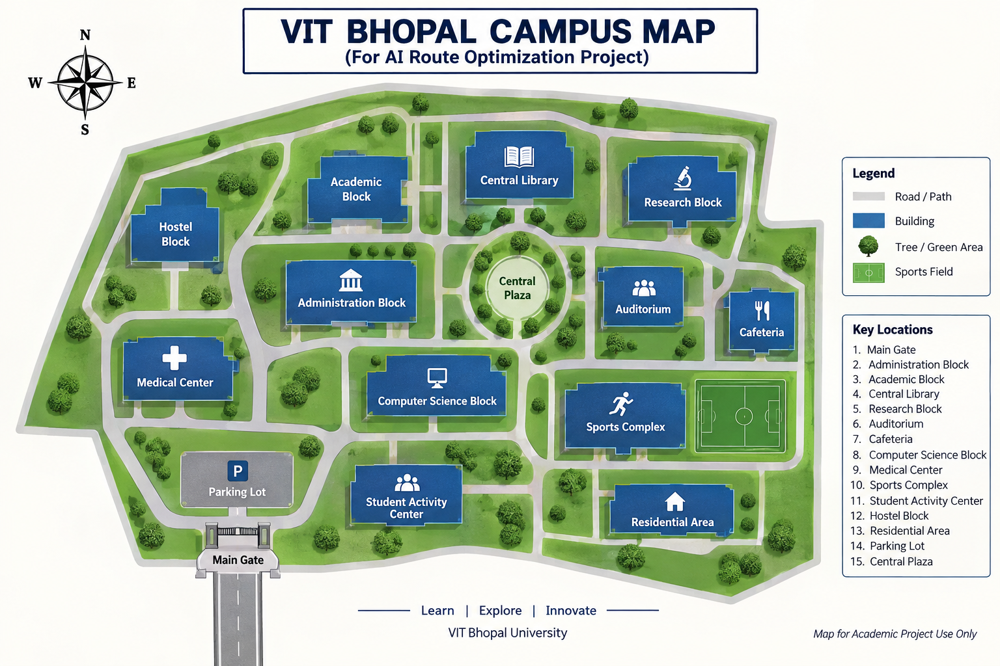

# 🤖 Intelligent Route Optimization System

### VITyarthi — AI/ML Project

> **A knowledge-driven AI system that finds efficient routes through a simulated university campus using Python, Prolog, logical reasoning, recursive search, and dynamic constraints.**

[](https://www.python.org/)
[](https://www.swi-prolog.org/)
[](https://pypi.org/project/pyswip/)
[]()
[]()

**GitHub Repository:**
https://github.com/AyanSharma01/Vityarthi-AI-ML-Project

---

## 🧭 Project at a Glance

**Intelligent Route Optimization System** is an academic Artificial Intelligence project that demonstrates how **Python and Prolog can work together to solve a route-planning problem**.

The system operates on a simulated university-campus network containing locations, connections, and predefined distances. A user provides a starting location and destination through the command line. The system then searches for valid paths while considering locations that may be **blocked or restricted**.

The Prolog knowledge base performs the logical route search, while Python manages user input, application execution, and communication with Prolog through **PySwip**.

### The core idea

```text
        USER
         │
         ▼
   Enter Route Details
         │
         ▼
       PYTHON
   Application Layer
         │
         ▼
      PYSWIP
 Python ↔ Prolog Bridge
         │
         ▼
      PROLOG
 Knowledge + Reasoning
         │
         ▼
   Search Valid Paths
         │
         ▼
 Compare Route Distances
         │
         ▼
  SHORTEST VALID ROUTE
         │
         ▼
       OUTPUT
```

> ⚠️ **Academic Simulation Notice:** The campus map, locations, route connections, and distances used in this project are simulated representations created for academic demonstration. They are not intended to represent an official VIT Bhopal navigation system.

---

# 🎯 Problem Statement

Route planning becomes more challenging when some locations in a network are unavailable because of temporary blockages or restrictions.

A route-planning system should therefore be able to:

* Represent locations and connections.
* Search for possible paths between two locations.
* Calculate the total distance of each valid path.
* Avoid unavailable locations.
* Compare candidate paths.
* Select the shortest valid route.
* Handle situations where no valid route exists.

This project addresses these requirements using a **knowledge-based Artificial Intelligence approach** with Python and Prolog.

---

# 🚀 Objectives

The project aims to:

1. Build a knowledge-based route optimization system.
2. Represent route information using Prolog facts and rules.
3. Apply recursive search to discover possible paths.
4. Calculate accumulated route distances.
5. Handle dynamically blocked and restricted locations.
6. Select the shortest valid route from available candidates.
7. Integrate Python and Prolog using PySwip.
8. Demonstrate practical applications of symbolic AI concepts.

---

# ✨ Key Features

| Feature                          | Description                                                      |
| -------------------------------- | ---------------------------------------------------------------- |
| 🗺️ **Route Planning**           | Finds valid paths between a source and destination               |
| 🧠 **Knowledge Representation**  | Stores locations, connections, and distances in Prolog           |
| 🔎 **Recursive Search**          | Explores possible paths through the network                      |
| 📏 **Distance Optimization**     | Compares accumulated route distances                             |
| 🔄 **Bidirectional Traversal**   | Supports movement between connected locations in both directions |
| 🚫 **Blocked Locations**         | Prevents selected locations from being used                      |
| 🔒 **Restricted Locations**      | Excludes restricted locations from valid routes                  |
| ⚡ **Dynamic Constraints**        | Runtime constraints can be supplied through the CLI              |
| ❌ **No-Route Handling**          | Reports when a valid route cannot be found                       |
| 🔗 **Python–Prolog Integration** | Uses PySwip to connect both technologies                         |
| 💻 **Command-Line Execution**    | Runs directly from a terminal without a GUI                      |

---

# 🧠 Artificial Intelligence Concepts

## 1. Knowledge Representation

The simulated campus environment is represented as a knowledge base using **Prolog facts and rules**.

The knowledge base contains information about:

* Locations
* Connections
* Distances
* Available locations
* Blocked locations
* Restricted locations
* Route-search rules

This allows the system to reason about the environment symbolically.

---

## 2. Search

The system uses recursive search to explore possible paths between the source and destination.

During the search, previously visited locations are tracked to prevent unnecessary cycles within a candidate path.

---

## 3. Constraint Handling

The route search can dynamically consider locations that are unavailable.

### 🚫 Blocked Location

A blocked location is excluded from route calculation.

Example:

```bash
python route_optimizer.py --start "Main Gate" --end "Central Library" --blocked "Administration Block"
```

### 🔒 Restricted Location

A restricted location is also excluded from valid route traversal.

Example:

```bash
python route_optimizer.py --start "Main Gate" --end "Central Library" --restricted "Administration Block"
```

---

## 4. Decision Making

After valid paths are identified, their accumulated distances are compared.

The system returns the valid path with the lowest calculated distance.

---

# 🏗️ System Architecture

```text
┌───────────────────────────────┐
│           USER                │
│ Start / Destination           │
│ Blocked / Restricted Inputs   │
└───────────────┬───────────────┘
                │
                ▼
┌───────────────────────────────┐
│      PYTHON APPLICATION       │
│      route_optimizer.py       │
│                               │
│ • Argument Handling           │
│ • Runtime Control             │
│ • Result Display              │
└───────────────┬───────────────┘
                │
                ▼
┌───────────────────────────────┐
│            PYSWIP             │
│     Python ↔ Prolog Bridge    │
└───────────────┬───────────────┘
                │
                ▼
┌───────────────────────────────┐
│      PROLOG KNOWLEDGE BASE    │
│       knowledge_base.pl       │
│                               │
│ • Route Facts                 │
│ • Distances                   │
│ • Constraints                 │
│ • Search Rules                │
└───────────────┬───────────────┘
                │
                ▼
┌───────────────────────────────┐
│       LOGICAL SEARCH          │
│                               │
│ • Explore Candidate Paths     │
│ • Track Visited Locations     │
│ • Apply Constraints           │
│ • Calculate Distances         │
└───────────────┬───────────────┘
                │
                ▼
┌───────────────────────────────┐
│     SHORTEST VALID ROUTE      │
│        + DISTANCE             │
└───────────────────────────────┘
```

---

# 🔄 System Workflow

```text
START
  │
  ▼
Enter Source Location
  │
  ▼
Enter Destination
  │
  ▼
Enter Optional Constraints
  │
  ├── Blocked Locations
  │
  └── Restricted Locations
  │
  ▼
Initialize Prolog Engine
  │
  ▼
Load Knowledge Base
  │
  ▼
Apply Runtime Constraints
  │
  ▼
Search Possible Paths
  │
  ▼
Check Location Availability
  │
  ▼
Calculate Path Distances
  │
  ▼
Compare Valid Paths
  │
  ├───────────────┐
  │               │
  ▼               ▼
Route Found     No Route
  │               │
  ▼               ▼
Display Route   Display
+ Distance      No-Route Message
  │
  ▼
 END
```

---

# 🗺️ Simulated Campus Environment

The project uses a simulated network containing **15 locations**.

### 📍 Locations

1. **Main Gate**
2. **Administration Block**
3. **Academic Block**
4. **Central Library**
5. **Research Block**
6. **Auditorium**
7. **Cafeteria**
8. **Computer Science Block**
9. **Medical Center**
10. **Sports Complex**
11. **Student Activity Center**
12. **Hostel Block**
13. **Residential Area**
14. **Parking Lot**
15. **Central Plaza**

---

## 🖼️ Campus Map

The following map represents the simulated environment used for the route-optimization system.



> The map is an illustrative academic representation and is not an official VIT Bhopal campus navigation map.

---

# 🧩 Main Components

## `route_optimizer.py`

The main Python application responsible for:

* Command-line argument handling
* Source and destination input
* Blocked-location input
* Restricted-location input
* Prolog engine initialization
* Knowledge-base loading
* Route-query execution
* Result presentation

---

## `knowledge_base.pl`

The Prolog knowledge base responsible for:

* Representing campus locations
* Defining route connections
* Storing simulated distances
* Supporting bidirectional traversal
* Handling blocked locations
* Handling restricted locations
* Performing recursive path search
* Selecting the shortest valid route

---

## `requirements.txt`

Contains the required Python dependency:

```text
PySwip==0.3.3
```

---

## `statement.md`

Contains the project's:

* Problem statement
* Scope
* Target users
* High-level features

---

## `project_report.md`

Contains detailed documentation covering:

* Introduction
* Problem Statement
* Functional Requirements
* Non-Functional Requirements
* System Architecture
* Design Diagrams
* Design Decisions
* Implementation Details
* Testing
* Challenges
* Learnings
* Future Enhancements
* References

---

## `project_report.pdf`

The structured project report prepared for the VITyarthi project submission.

---

## `campus_map.png`

Illustrative map of the simulated campus environment used by the system.

---

# 🛠️ Technologies & Tools

| Technology     | Role in Project                                |
| -------------- | ---------------------------------------------- |
| **Python**     | Application control and CLI                    |
| **Prolog**     | Knowledge representation and logical reasoning |
| **SWI-Prolog** | Prolog execution environment                   |
| **PySwip**     | Python–Prolog communication                    |
| **GitHub**     | Repository hosting and version control         |

---

# 💻 Installation

## Step 1 — Clone the Repository

```bash
git clone https://github.com/AyanSharma01/Vityarthi-AI-ML-Project.git
```

Navigate into the project:

```bash
cd Vityarthi-AI-ML-Project
```

---

## Step 2 — Verify Python

Python **3.8 or later** is recommended.

Check your Python version:

```bash
python --version
```

---

## Step 3 — Install SWI-Prolog

Install **SWI-Prolog** on your system.

Verify the installation:

```bash
swipl --version
```

Make sure SWI-Prolog is available through the system PATH.

---

## Step 4 — Install Python Dependencies

Run:

```bash
pip install -r requirements.txt
```

---

# ▶️ Running the Application

## 🔹 Basic Route Search

```bash
python route_optimizer.py --start "Main Gate" --end "Central Library"
```

---

## 🔹 Route with a Blocked Location

```bash
python route_optimizer.py --start "Main Gate" --end "Central Library" --blocked "Administration Block"
```

The system avoids the blocked location and searches for another valid route.

---

## 🔹 Route with a Restricted Location

```bash
python route_optimizer.py --start "Main Gate" --end "Central Library" --restricted "Administration Block"
```

The restricted location is excluded from valid route traversal.

---

## 🔹 Multiple Blocked Locations

```bash
python route_optimizer.py --start "Main Gate" --end "Sports Complex" --blocked "Central Plaza" "Auditorium"
```

Multiple locations can be supplied as blocked locations.

> **Note:** Location names must match the names defined in `knowledge_base.pl`.

---

# 📊 Example Execution

### Input

```text
Start       : Main Gate
Destination : Central Library
```

### System Output

```text
========================================================
                 AI ROUTE OPTIMIZER
========================================================

[>] Start       : Main Gate
[>] Destination : Central Library

[>] Searching for a valid route...

[+] OPTIMAL ROUTE FOUND

Path     : Main Gate -> Administration Block -> Central Plaza -> Central Library
Distance : 350 units
```

### Distance Calculation

```text
Main Gate
    │
    │ 120 units
    ▼
Administration Block
    │
    │ 130 units
    ▼
Central Plaza
    │
    │ 100 units
    ▼
Central Library
```

```text
Total Distance = 120 + 130 + 100
               = 350 units
```

> The route distances are simulated values defined in the Prolog knowledge base.

---

# 🧪 Testing

The system can be tested using different combinations of routes and constraints.

| Test Case | Scenario                      | Expected Behaviour                         |
| --------- | ----------------------------- | ------------------------------------------ |
| **TC-01** | Normal route                  | Returns a valid shortest route             |
| **TC-02** | Destination blocked           | Reports no valid route                     |
| **TC-03** | Destination restricted        | Reports no valid route                     |
| **TC-04** | Intermediate location blocked | Searches for an alternative route          |
| **TC-05** | Multiple locations blocked    | Avoids all specified unavailable locations |

---

## Test Case 1 — Normal Route

```bash
python route_optimizer.py --start "Main Gate" --end "Central Library"
```

**Expected:** A valid route and total distance are displayed.

---

## Test Case 2 — Blocked Destination

```bash
python route_optimizer.py --start "Main Gate" --end "Central Library" --blocked "Central Library"
```

**Expected:** No valid route is available.

---

## Test Case 3 — Restricted Destination

```bash
python route_optimizer.py --start "Main Gate" --end "Central Library" --restricted "Central Library"
```

**Expected:** No valid route is available.

---

## Test Case 4 — Blocked Intermediate Location

```bash
python route_optimizer.py --start "Main Gate" --end "Central Library" --blocked "Administration Block"
```

**Expected:** The system searches for an alternative route that does not use the blocked location.

---

## Test Case 5 — Multiple Blocked Locations

```bash
python route_optimizer.py --start "Main Gate" --end "Sports Complex" --blocked "Central Plaza" "Auditorium"
```

**Expected:** The system avoids the specified blocked locations and searches for another valid route if one exists.

---

# 🛡️ Constraint & Error Handling

The system is designed to handle situations such as:

* A blocked destination
* A restricted destination
* A blocked intermediate location
* Multiple unavailable locations
* No valid path between source and destination

The route-search logic checks location availability before accepting a location as part of a candidate route.

---

# 📈 Advantages

### ✅ Knowledge-Based

The system uses an explicit knowledge base instead of relying only on hard-coded procedural route logic.

### ✅ Explainable

The route network, distances, constraints, and search rules are explicitly represented.

### ✅ Dynamic

Blocked and restricted locations can be supplied at runtime.

### ✅ Modular Concept

Python handles application-level control while Prolog handles logical reasoning and search.

### ✅ Extendable

The simulated network can be expanded with additional locations, connections, and constraints.

### ✅ Academic Relevance

The project demonstrates several Artificial Intelligence concepts in a practical route-planning scenario.

---

# ⚠️ Current Limitations

The current version has several limitations:

* The campus environment is simulated.
* Route distances are predefined.
* No real-time traffic information is used.
* GPS or live location tracking is not implemented.
* The current interface is command-line based.
* Route information must be defined in the Prolog knowledge base.
* The system is intended for academic demonstration rather than real-world navigation.

---

# 🚀 Future Enhancements

Future versions could include:

* 🗺️ Interactive graphical campus map
* 📍 GPS-based location support
* 🚦 Real-time traffic or congestion simulation
* 🔄 Dynamic route updates
* 🛣️ Multiple alternative route suggestions
* 🗄️ Database-backed route information
* 📱 Web or mobile interface
* 🧠 More advanced optimization algorithms
* 🌐 Integration with a real campus map
* 📊 Route analysis and visualization

---

# 🎓 Learning Outcomes

This project provided practical experience with:

* Artificial Intelligence problem solving
* Knowledge representation
* Symbolic reasoning
* Prolog facts and rules
* Recursive search
* Path finding
* Constraint handling
* Distance-based optimization
* Python–Prolog integration
* Command-line application development
* Testing and validation
* GitHub project management

---

# 📁 Repository Structure

```text
Vityarthi-AI-ML-Project/
│
├── 📄 README.md
├── 📄 statement.md
├── 📄 project_report.pdf
├── 📄 project_report.md
│
├── 🐍 route_optimizer.py
├── 🧠 knowledge_base.pl
│
├── 📦 requirements.txt
├── 🗺️ campus_map.png
│
└── ⚙️ .gitignore
```

---

# 📚 Project Documentation

| Document                  | Purpose                                               |
| ------------------------- | ----------------------------------------------------- |
| 📄 **README.md**          | Project overview, setup, usage, and technical details |
| 📄 **statement.md**       | Problem statement, scope, target users, and features  |
| 📄 **project_report.md**  | Detailed project documentation                        |
| 📄 **project_report.pdf** | Structured VITyarthi project report                   |
| 🗺️ **campus_map.png**    | Simulated campus environment                          |

---

# 🔬 Project Scope

This project focuses on demonstrating **knowledge-based route optimization using symbolic Artificial Intelligence**.

The system is designed as an academic prototype rather than a real-world navigation application.

Its primary focus is the interaction between:

```text
Knowledge Representation
          +
Logical Reasoning
          +
Search
          +
Constraint Handling
          +
Distance Optimization
```

---

# 👨‍💻 Developer

### Ayan Sharma

**Program:** Integrated M.Tech in Artificial Intelligence
**University:** VIT Bhopal University
**Registration Number:** 25MIM10136

---

# 📌 Academic Project Notice

This project has been developed as an academic demonstration of Artificial Intelligence concepts.

The campus environment, route network, map, and distance values are simulated for educational purposes. They should not be interpreted as official VIT Bhopal navigation data.

---

# ⭐ Project Summary

**Intelligent Route Optimization System** demonstrates how **Python and Prolog can be combined to solve a practical Artificial Intelligence problem**.

Python manages the application interface and runtime inputs, while Prolog provides the knowledge representation, logical reasoning, recursive search, constraint handling, and route selection.

The project demonstrates how symbolic AI techniques can be applied to route optimization in a dynamic environment where some locations may become unavailable.

---

### 🔗 Repository

**Ayan Sharma — VITyarthi AI/ML Project**

https://github.com/AyanSharma01/Vityarthi-AI-ML-Project
